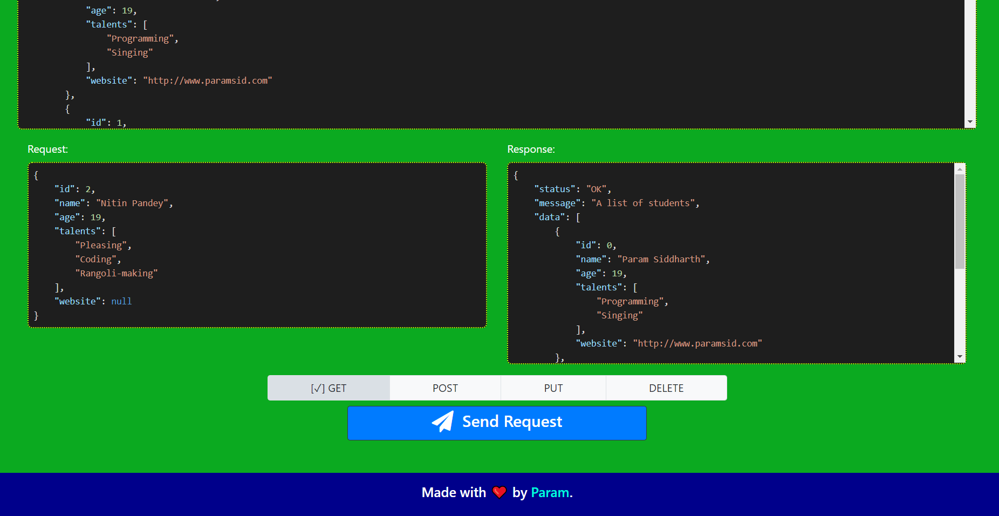

# REST API Playground
A virtual REST API for learners to play around with.


Click [here](https://paramsiddharth.github.io/rest-api-playground) to view it online.

## Usage
This website has been created specifically for educational purposes. It provides a very user-friendly environment for new learners and allows them to explore the powers of the REST API on the client-side itself.

## Development
- Install the dependencies.
  ``` bash
  npm ci
  ```
- Serve up the website.
  ``` bash
  npm start
  ```

The website will be live at http://localhost:5000.